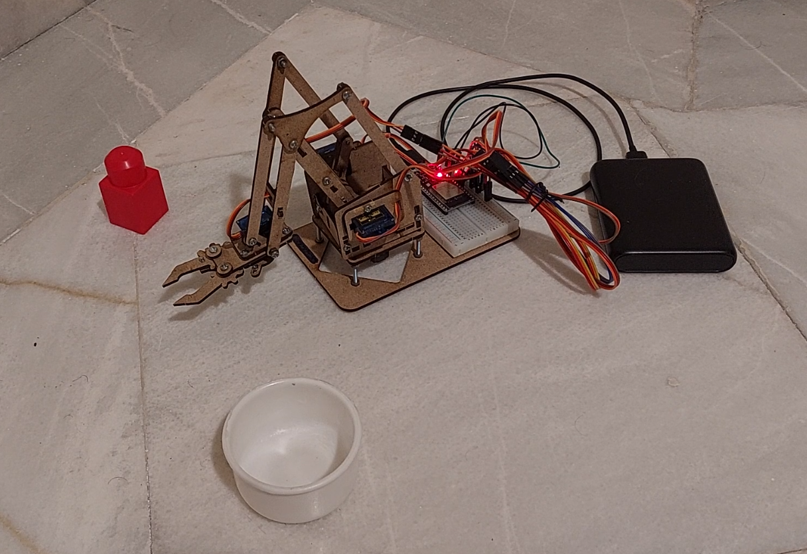

# meArm with WiFi control

This project enables wireless control of a MeArm robotic arm using an ESP32 microcontroller over WiFi connectivity. 
The system utilizes the UDP protocol for real-time communication, allowing users to send movement commands from any device on the same network. 
The robotic arm can be controlled across multiple axes, including base rotation, horizontal and vertical movement, and gripper operation for opening and closing functions.

The implementation uses four servo motors connected to the ESP32. One for base rotation, one for gripper operation, and the other two for the shoulder and elbow joints that enable horizontal and vertical movement.
Control commands are sent as simple text strings over UDP as four comma-separated floating-point numbers, where values range from -5 to 5, representing movement across four axes.

